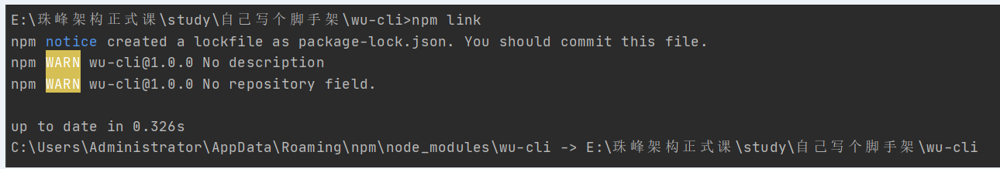
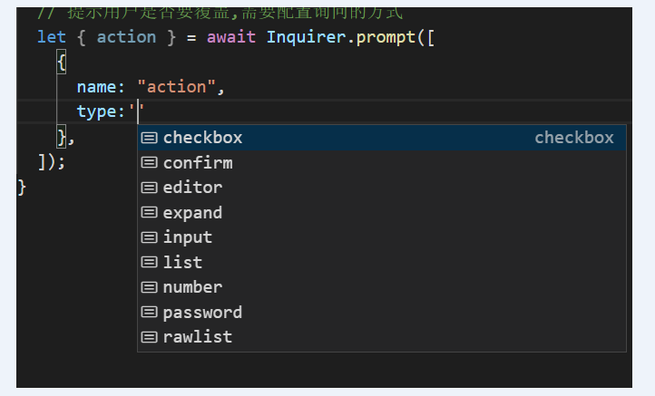

# 搭建一个vue-cli 脚手架

###  一、需要的工具或插件

- **commander** ：参数解析 --help其实就借助了他~
- **fs-extra** ：fs 文件处理模块， 比原 fs 模块功能更强一些；
- **inquirer** ：交互式命令行工具，有他就可以实现命令行的选择功能
- **download-git-repo** ：在git中下载模板
- **axios 发请求拉取模板**；
- **chalk** ：粉笔帮我们在控制台中画出各种各样的颜色, 注意版本问题；
- **metalsmith** ：读取所有文件,实现模板渲染
- **consolidate** ：统一模板引擎
- **ora**  显示命令行的 loading，表示正在加载中；


### 二、环境准备,配置可执行命令

1. 创建一个项目 wu-cli，根目录下创建 bin 目录，创建文件 xxx，此文件没有任何后缀, j作为 js 文件解析，一般与 package.json 中的 name  保持一致；

   ```shell
   #! /usr/bin/env node     # 表示需要在 node 环境下运行
   ```

2. 在 package.json 顶层中添加 bin 属性，指向脚本文件；

   ```shell
   "bin": "./bin/xxx"
   # 也可以以映射表的形式来使用别名
   "bin":{
   	"wu": "./bin/xxx",   # wu ...形式
   	"wu-cli": "./bin/xxx",  # 使用 wu-cli ...形式
   }
   ```

3. 在根目录下运行以下命令，将以上脚本链接到本地全局中；本地会创建一个脚本目录， 此目录名默认与package.json 中的 name 保持一致，也可以配置映射表，如上；

   ```shell
   npm  link --force   # 强制关联，然后会产生命令
   # 本地创建的脚本命令目录
   C:\Users\Administrator\AppData\Roaming\npm\node_modules\xxx 
   
   本地 C:\Users\Administrator\AppData\Roaming\npm 下会创建 xxx.cmd 文件
   ```

4. 解除 link 关联

   ```shell
   npm unlink  --force  
   ```

   

### 三、使用 commander 制作命令行解析工具

```shell
# 安装 
npm i commander
```

1.   commander 的使用

   > command() 表示创建一个命令， option() 是配置此命令的参数，多个参数需要多次调用，description 是运行 help 命令时可以看到的描述，action() 是执行此命令后需要实现的操作
   >
   > on() 可以监听事件，

   ```js
   const program = require("commander");
   
   program
     .command("create [app-name]") // 创建新项目, <> 或 [] 内表示参数
     .description("create a new project") // 命令描述
     .option("-f --force", "overwrite target directory if it exists") // 如果重名, 需要强制创建
     .action((name, options, cmd) => {
       // name 表示第一个参数的值，app-name
       console.log("name-----", name);
       console.log("options-----", options);
       console.log("cmd-----", cmd);
     });
   
   program.on("--help", () => {
     console.log();
     console.log("Run wu-cli <command> --help show details");
     console.log();
   });
   
   
   ```



### 四、创建项目

1. 使用 axios 发请求来拉取当前组织下的模板；

2. 通过模板找到版本号；

3. 下载到指定目录；用 gitclone 方式也可以；

   


